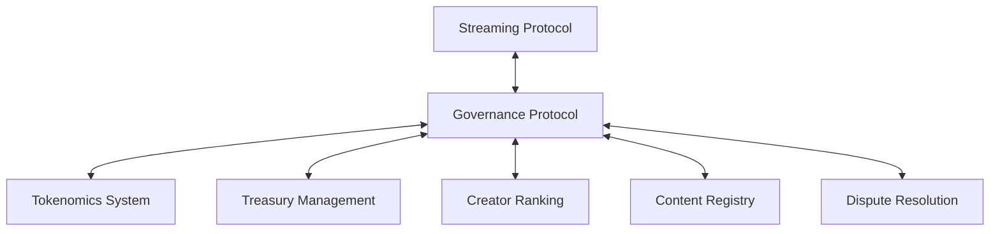

# Governance Technical Specifications

## System Architecture

The Web3 Crypto Streaming Service governance system consists of the following components:

### Smart Contract Infrastructure

```solidity
// Core governance contracts hierarchy
GovernanceToken.sol
├── StreamToken.sol
└── CreatorCredits.sol

GovernanceCore.sol
├── ProposalManager.sol
├── VotingEngine.sol
└── ExecutionController.sol

GovernanceModifiers.sol
├── QuadraticVotingModifier.sol
├── ConvictionVotingModifier.sol
└── ReputationWeightModifier.sol

TimelockController.sol
GovernanceRegistry.sol
```

### Staking & Delegation System

- **Staking Contract**: Handles token staking for governance participation
- **Delegation Registry**: Tracks vote delegation relationships
- **Voting Power Calculator**: Computes effective voting power based on multiple factors

### On-Chain vs. Off-Chain Components

| Component | Location | Rationale |
|-----------|----------|-----------|
| Proposal Storage | On-chain | Immutability and transparency |
| Voting Records | On-chain | Verifiability and auditability |
| Discussion Forums | Off-chain | Cost efficiency |
| Proposal Drafting | Off-chain | Flexibility and iteration |
| Analytics | Hybrid | Balance between transparency and efficiency |

## Technical Implementation

### Cryptographic Mechanisms

The governance system employs several cryptographic mechanisms:

1. **zk-SNARKs for Anonymous Voting**: Ensures voter privacy while maintaining verifiability
2. **Threshold Signatures**: For multi-sig execution of sensitive operations
3. **Commit-Reveal Voting**: Prevents front-running and vote manipulation

### Integration Points



### Reputation-Weighted Proof of Stake Formula

The reputation score calculation that forms the basis of our primary consensus mechanism:

